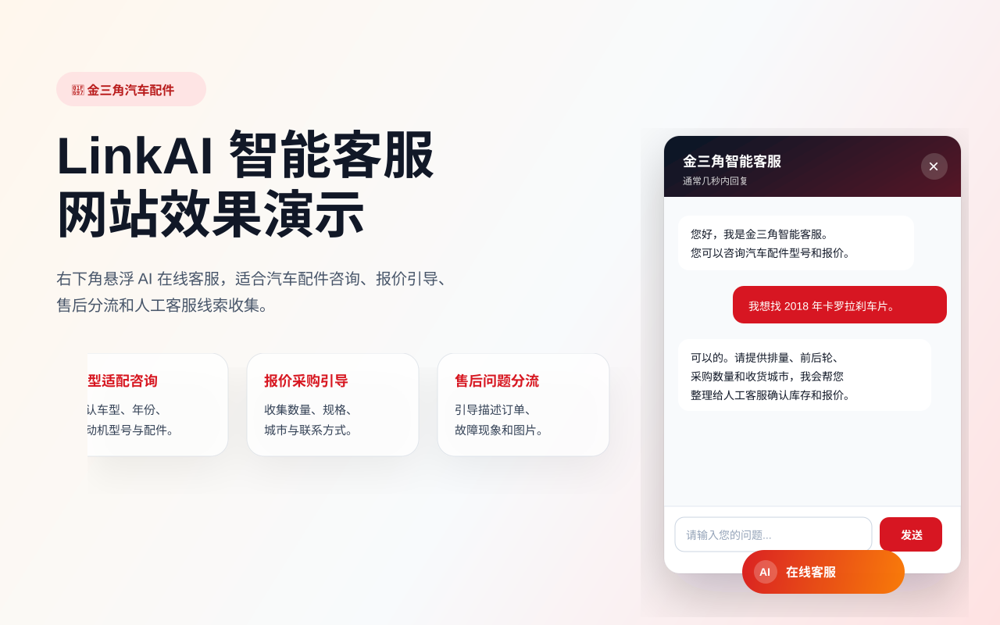

# jinshanjiao

A suitable car parts website for deployment on WordPress.

## LinkAI 智能 AI 客服插件

本仓库提供一个 WordPress 插件，可在网站右下角显示汽车配件行业智能客服，并通过 WordPress AJAX 在服务端调用 LinkAI 通用对话接口，避免把 API Key 暴露到浏览器。

### 功能

- 全站右下角悬浮智能客服窗口，自动显示会同时兼容 `wp_body_open` 和 `wp_footer`。
- 支持短代码 `[linkai_customer_service]` 嵌入指定页面。
- WordPress 后台可配置 LinkAI API Key，支持已保存密钥提示、留空保留、重新填写替换和清除密钥。
- 后台配置应用 Code、模型、温度、欢迎语、系统提示词，以及 GitHub 更新仓库和分支。
- 自动携带最近 8 条上下文，让客服具备连续对话能力。
- 自动记录客户姓名、联系方式、IP、国家/地区、设备、跟进状态、备注、最后咨询内容和完整聊天记录，后台可在左侧「LinkAI 客服 → 客户管理」查看和维护。
- 默认提示词适配汽车配件咨询场景，会主动收集车型、年份、发动机型号、数量和联系方式。


### 效果预览

可以直接打开仓库根目录的 `demo.html` 查看静态演示，也可以查看 `docs/demo-preview.svg` 了解右下角智能客服的大致样式。



### 安装

1. 将仓库文件上传到 WordPress 的 `wp-content/plugins/linkai-ai-customer-service/` 目录。
2. 在 WordPress 后台「插件」中启用 **LinkAI 智能 AI 客服**。
3. 进入「设置 → LinkAI 智能客服」，填写 LinkAI API Key；保存后输入框会隐藏密钥，后续留空保存不会覆盖原密钥。
4. 可选填写 LinkAI 应用、工作流或超级 AI 助理的 `app_code`；不填时将直接调用模型能力。
5. 保存后访问网站前台，右下角会自动出现「在线客服」。

### 客户记录管理

插件启用后会创建客户和聊天记录数据表。访客在聊天窗口填写姓名、电话/微信并发送消息后，后台会自动保存；插件更新后进入客户管理页面也会自动补齐新增字段：

- 客户姓名和联系方式
- IP 地址、国家/地区、设备类型和浏览器 User Agent
- 首次咨询、最后咨询和 AI 最后回复
- 完整用户/AI 聊天记录
- 跟进状态和客户备注
- 会话 ID 和更新时间

管理员可以进入后台左侧菜单「LinkAI 客服 → 客户管理」查看最近 100 个客户，并点击客户查看完整聊天详情；也可以补充/修改客户姓名、联系方式、跟进状态和客户备注，方便后续人工跟进。插件列表中也会显示「客户管理」快捷入口。

### 后台一键更新

如果你把插件代码放在 GitHub 仓库中，可以在「设置 → LinkAI 智能客服」里填写：

- GitHub 更新仓库： `https://github.com/OSAMA-BIN-AZIZ/jinshanjiao`
- 更新分支：默认 `main`

之后每次在 GitHub 更新插件时，请同步提高 `linkai-ai-customer-service.php` 文件头部的 `Version` 版本号。WordPress 后台「插件」页面只有在 GitHub 远程版本高于当前已安装版本时才会显示更新提示；如果你刚刚手动上传了最新版本，远程和本地版本相同就不会提示更新。更新器会以固定目录名 `jinshanjiao-main` 为准，避免 GitHub 分支压缩包目录名和 WordPress 插件目录名不一致导致 WordPress 报「更新失败：文件系统错误」。插件页会自动刷新 GitHub 远程版本，不需要先手动清除缓存才检测更新；如果仍然失败，可在「LinkAI 客服 → 设置 → 更新排查」查看“更新包下载地址”，或点击「尝试修复插件权限」让插件尝试把目录设为可写。WordPress 更新时会自动下载 ZIP 并解压；“无法安装这个包”通常表示下载到的内容不是有效插件 ZIP，或 ZIP 解压后找不到 `linkai-ai-customer-service.php`。手动上传的插件常见问题是文件所有者不是 WordPress/PHP 运行用户，这种情况仍需通过主机面板、FTP 或 SSH 修改所有者。


### 上传到 WordPress 插件市场

如果你想提交到 WordPress.org 插件目录（插件市场），不能直接把 GitHub ZIP 当作市场发布包。WordPress.org 首次提交需要准备 `readme.txt` 并通过官方提交页面审核；审核通过后，后续发布使用 WordPress.org 提供的 SVN 仓库提交文件，而不是上传 ZIP。官方文档也说明 SVN 中应提交单独文件，不应上传 ZIP 包。

本仓库已添加 `readme.txt`，可作为提交插件目录的基础说明文件。提交前请把 `Contributors` 改成你的 WordPress.org 用户名，并确认插件名称、授权、截图和说明符合 WordPress.org 插件规范。

### LinkAI 接口说明

插件调用的接口为：

```http
POST https://api.link-ai.tech/v1/chat/completions
Authorization: Bearer YOUR_API_KEY
Content-Type: application/json
```

请求体会传入 `messages`，并按配置附加 `app_code`、`model` 和 `temperature`。

### 安全建议

- 不要在前端 JavaScript 中硬编码 API Key；请统一在「设置 → LinkAI 智能客服」中保存。
- 建议在 LinkAI 后台为网站单独创建 API Key，并定期轮换。
- 如果业务需要严格报价或库存，请在 LinkAI 应用中绑定真实知识库或工作流。
